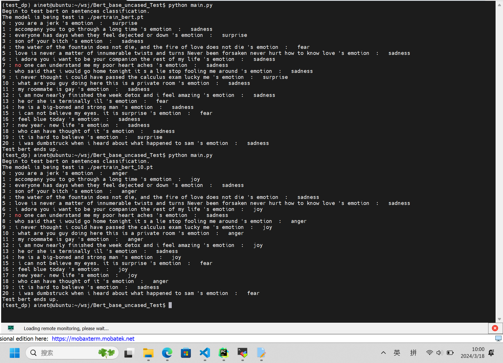
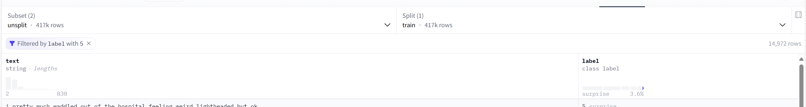
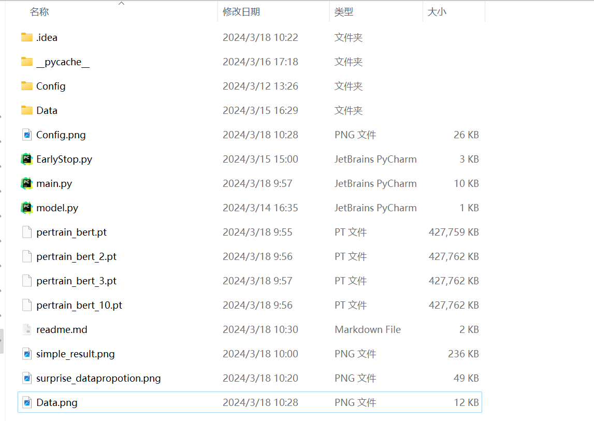
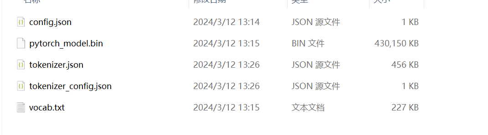
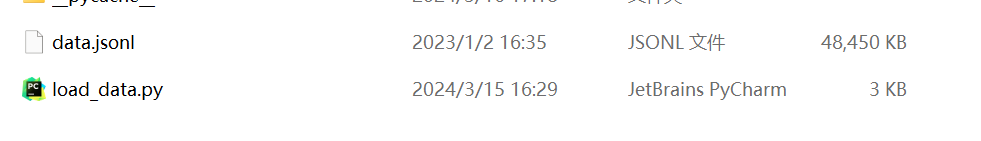

# Bert on Emotion


### 一、实验介绍

基于huggingface上面bert-base-uncased模型的模型微调，验证在情绪数据集上的有效性。


### 二、实验环境

```
torch==1.12.1
pandas==2.2.1
transformers==4.38.2
python==3.9.18
```

使用Anaconda虚拟环境将上述的依赖包粘贴到requirements.txt中并使用以下命令进行安装：

```
pip install -r requirements.txt
```


### 四、实验数据集

数据集的网站：[dair-ai/emotion · Datasets at Hugging Face](https://huggingface.co/datasets/dair-ai/emotion/viewer/unsplit)

使用了unsplit来自己划分。


### 五、实验结果



18-20应该都是surprise，但是都预测错了，感觉是数据集分布的问题，看了一下surprise占比很少：




### 六、如何训练

##### 6.1 整体文件结构：



```
--Config 放的是从huggingface上下载下来的bert-base-uncased的权重
--Data 存放数据文件
--EarlyStop.py 早停的类
--main.py 运行主函数，包括训练和验证，文件里设定choice=0表示加载没有微调的模型， choice=1为训练模式，choice=2为测试模式
--model.py 存放模型
```

##### 6.2 其中Config文件夹里面文件结构是这样：（从官网下载）



##### 6.3 Data文件夹里这样：



##### 6.4 执行以下命令运行：

```
python main.py
```


### 七、参考

1、EarlyStop：[Bjarten/early-stopping-pytorch: Early stopping for PyTorch (github.com)](https://github.com/Bjarten/early-stopping-pytorch/tree/master)

2、训练的框架：[保姆级教程，用PyTorch和BERT进行文本分类 - 知乎 (zhihu.com)](https://zhuanlan.zhihu.com/p/524487313)

3、报错相关：[解决报错：CUBLAS_STATUS_INVALID_VALUE when calling `cublasSgemmStridedBatched( handle, opa, opb, m......_runtimeerror: cuda error: cublas_status_invalid_va-CSDN博客](https://blog.csdn.net/qq_44824148/article/details/133307138)

